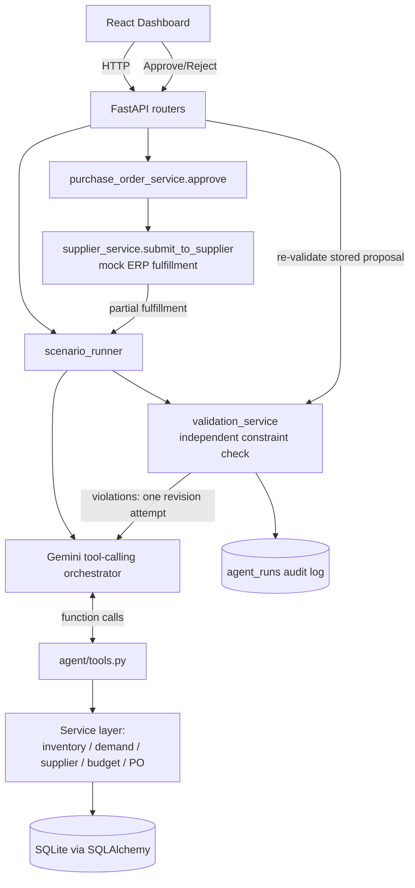

# Architecture

The loop that matters: **investigate (tool calls) → decide (LLM) → validate (code, independent of the LLM) → revise once if the validator objects → human approval gate → execute → mock ERP outcome → re-invoke agent if the outcome diverges from expectation.** The investigate/decide/validate steps never touch the database; only approval can create or amend a real purchase order, and the approval endpoints re-derive the proposal from its stored agent run and re-run the validator before writing — the client only supplies an agent run id.

The final arrow is real code, not an aspiration: `POST /api/purchase-orders/{po_id}/approve` inspects the status the mock ERP returned and, on `partially_fulfilled`, calls `scenario_runner.execute_supplier_shortfall` with the actual fulfilled quantity, which creates a fresh agent run for the buyer to review.
