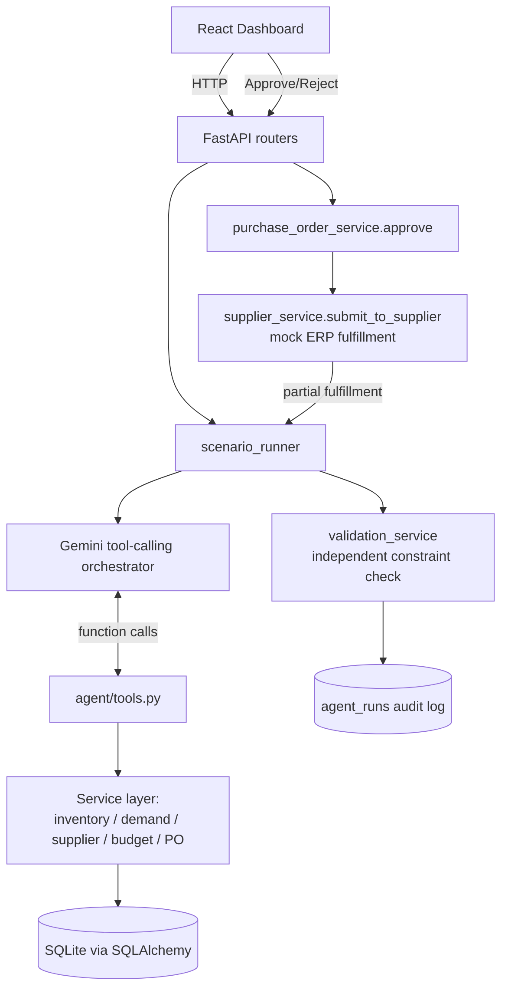

# Architecture

The loop that matters: **investigate (tool calls) → decide (LLM) → validate (code, independent of the LLM) → human approval gate → execute → mock ERP outcome → re-invoke agent if the outcome diverges from expectation.** Steps 1-3 never touch the database; only approval (step 4) can create or amend a real purchase order.
